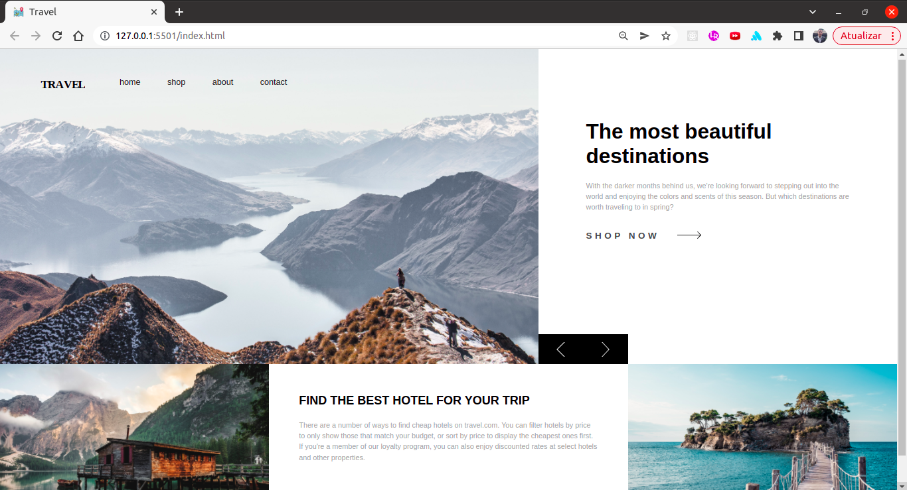

<h1 align="center"></h1>

Este projeto tem por objetivo apresentar a página inicial de um site de viagem.

 <a href="#sobre">Sobre</a> •
 <a href="#roteiro">Roteiro</a> • 
 <a href="#tecnologias">Pilha de Tecnologias</a> • 
 <a href="#experiencia">Objetivo</a> •
 <a href="#licenc-a">Licença</a> • 
 <a href="#autor">Autor</a>

<h4 align="center"> 
	✅  Site dinâmico &nbsp; ▶ Homepage concluída.
</h4>

 

  

[Visão Geral](#visao)
===================

## 🛠 [Objetivo](#objetivo)
 
  &nbsp; &nbsp; &nbsp; &nbsp; ▶ &nbsp; O objetivo inicial deste deste projeto é apresentar o travel.com, um website de viagens. A inpiração para o layout é de um projeto de desafio proposto pelo Frontend Mentor de uma página de venda de móveis. A partir disso, fiz minhas próprias alterações no layout inicial e repliquei o desafio para uma página de vendas de pacotes de viagens.

 

## 📝 [Roteiro](#roteiro)

 

📍 Confira nosso quadro para mais detalhes sobre o que já foi construido.
 

- [x] Grid
- [x] Flexbox
- [x] Media Queries
- [x] Layout líquido
- [x] Área de contato

📌 Ainda haverá uma nova versão, confira os próximos passos.

-   [ ] próxima versão da Travel (React, TypeScript, Javascript, Bootstrap, HTML e CSS, Node.Js, SQL)

## ⛳ [Objetivo](#experiencia)

Este projeto é para fins de estudo, uma pequena aplicação do que aprendi em desenvolvimento web com html e css, JavaScript, jQuey.

    📌 Aplicação de conhecimentos HTML e CSS, JS, jQuery
    📌 Navegação com abas
    📌 Carousel de imagens
    📌 Sistema de Grids
    📌 FlexBox
    📌 Media Queries
    📌 Layout líquido

Espero que este projeto alcance o objetivo principal que é apresentar minha experiência com Desenvolvedor front-end

 

## 💻 [Tecnologias](#tecnologias)

 

&nbsp;&nbsp;&nbsp;&nbsp;

&nbsp;&nbsp;&nbsp;&nbsp;

&nbsp;&nbsp;&nbsp;&nbsp;

&nbsp;&nbsp;&nbsp;&nbsp;

&nbsp;&nbsp;&nbsp;&nbsp; 

&nbsp;&nbsp;&nbsp;&nbsp; 

 

## 🎬 [A seguir alguns screenshots do projeto Travel]()

 

  <kbd>
    
Para desktops e monitores maiores que 1280px

     
    

  </kbd>
  <kbd>
       
    
Para notebooks e dispositivos menores que 1279px e maiores que 769px

     
    

       
  </kbd>
  <kbd>
    
Para tablets e dispositivos menores que 768px e maiores que 481px

    

       
  </kbd>
  <kbd>
    
Para dispositivos mobile até 480px/p>
     
    

  </kbd>

